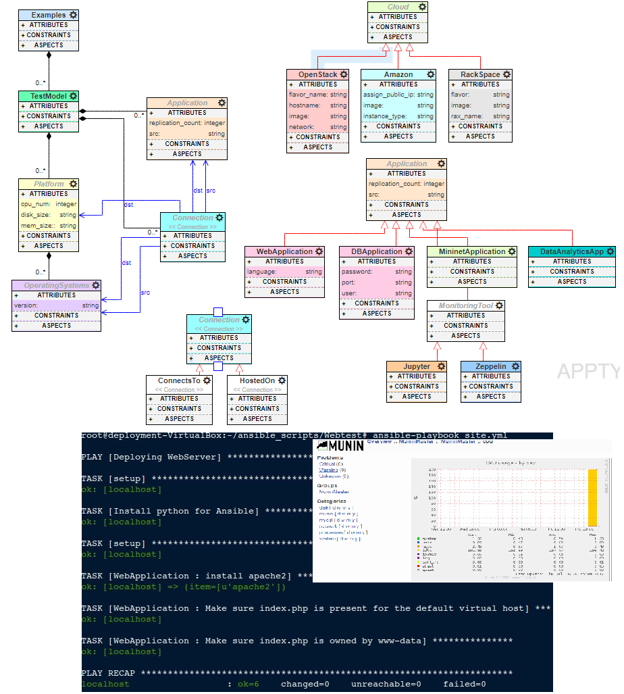

# DeploymentAutomation
## Installation

First, install the DeploymentAutomation following:
- [NodeJS](https://nodejs.org/en/) (v4.x.x recommended)
- [MongoDB](https://www.mongodb.com/)
- [git](https://github.com/git)
- [MySQL](https://www.mysql.com/)

Second, start mongodb locally by running the `mongod` executable in your mongodb installation (you may need to create a `data` directory or set `--dbpath`).
Start MySQL sevice and log in to MySQL as the root user:  
mysql -u root -p 

Import a MySQL Database schema
SW_Dep.sql

Then, run `webgme start` from the project root to start . Finally, navigate to `http://localhost:8080` to start using DeploymentAutomation!

For more info please refer to https://github.com/webgme

## Ansible Installation

Latest Releases Via Apt (Ubuntu)
Ubuntu builds are available in a PPA here.

To configure the PPA on your machine and install ansible run these commands:
 -`$ sudo apt-get install software-properties-common` 
  -`$ sudo apt-add-repository ppa:ansible/ansible` 
 -`$ sudo apt-get update` 
 -`$ sudo apt-get install ansible` 

For more info please refer to https://docs.ansible.com/ansible/intro_installation.html

